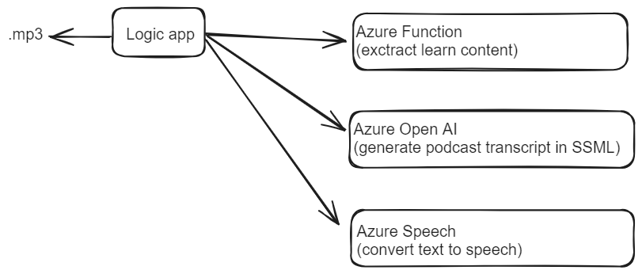

# mslearnpodcast

This project aims to generate podcasts from Microsoft Learn modules. A conversation happens between Brian (the interviewer) and Andrew (guest), and they discuss the topics of certain module in detail.

All of the content is generated using Azure OpenAI and translated to speech using the SDK. This is how the process works:

There is a logic app, which will perform the processing. It accepts one input: the URL of a Learn Module (main)

```txt
https://prod-23.eastus.logic.azure.com/workflows/1dd4e45a92de41fc8e0cf0044980577d/triggers/manual/paths/invoke?api-version=2016-10-01&sp=%2Ftriggers%2Fmanual%2Frun&sv=1.0&sig=rjYWaYRnIWe4qh84C-Qwg7gxyJ9O5gBJHmgCrYwDmRQ&url=https://learn.microsoft.com/en-us/training/modules/introduction-to-azure-app-service/
```

- The logic app will take the learn module URL (main page) and extract all the unit contents from it. It calls an Azure Function, which uses beatifullsoup to parse the contents.
- A prompt is send to Azure OpenAI to create the podcast. The prompt will contain the learn module output and produces a transcript that is immediatly formatted using the Speech Syntheses Markup Language
- The resulting output is transformed using the Speech SDK into an mp3 file, which is send as an output file from the podcast.



You can find some example output in the [az-204-podcast](./az-204-podcast/) folder

## Prerequisites

- Deploy an Azure OpenAI resource
- Deploy the gpt-35-turbo-16k model (with same name)
- Set the OPENAI_API_KEY
- Create an Azure Speech Service
- Set the SPEECH_API_KEY

## Prompt used

```txt
We're going to create a podcast, based on the below text.
- Include an introduction into the topic where the both the interviewer and the guest introduce themselves.
- The interviewer is Brian, who will be asking the questions.
- Andrew, as a guest, is supposed to respond in natural language, with short sentences.
- Andrew works for Contoso.
- Keep the conversation engaging by moving back and forth between Brian and Andrew. 
- The tone of the conversation should be friendly. Avoid repeating their names.
- Make sure to cover all the topics from the text below. 
- Do not remove any topics from the text.
- Do not summarize!
- Make sure to cover ALL topics!
- Do not use slang and keep it professional.
- Add also a short ending at the end of the podcast.
- Do not include code or command fragments in the output.
- Do not refer to the article, as we do not have access to it in the podcast.
- The podcast is named the "Microsoft Learn Podcast"
- Do not add breaks to the podcast
- Every paragraph should be enclosed by a <voice> and </voice> element.
- The output should be about 10000 words.
- Do not include exercises.
- When discussing bullet points, add a bit more context.
- Before responding, transform the text to the Speech Syntheses Markup Language. The output should be XML.
- Make sure that every paragraph is wrapped in a <voice> section. Brian should use the voice with name "en-US-BrianNeural". Andrew should use the voice with name "en-US-AndrewNeural".
- Finally, make sure there is the following element at the start: <speak xmlns="http://www.w3.org/2001/10/synthesis" xmlns:mstts="http://www.w3.org/2001/mstts" xmlns:emo="http://www.w3.org/2009/10/emotionml" version="1.0" xml:lang="en-US">
End the XML document with the following element: </speak>
---
[[learn module contents]]
```

## Potential issues

- Max token length is limited as I don't have access to GPT4-32K
- The conversation as such is pretty high level.
- Potentially getting into exceptions when going over the limit
- SSML not being formatted correctly (the output of the prompt)